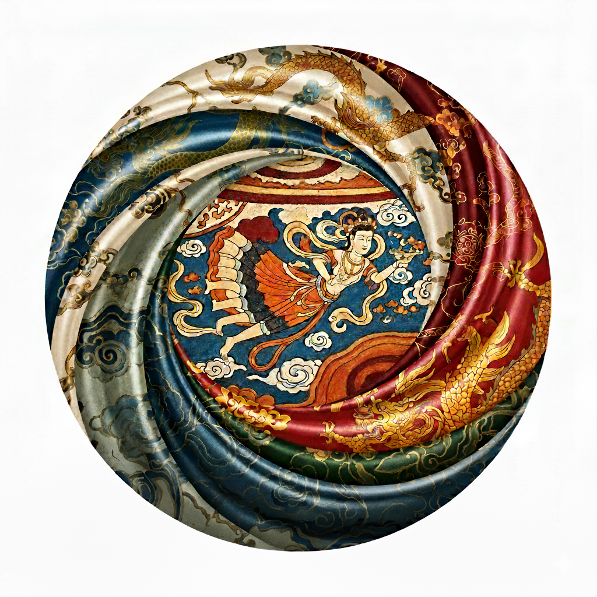
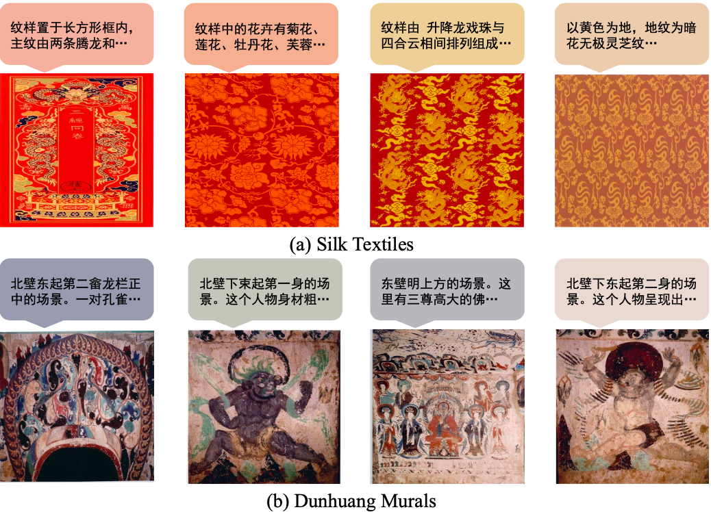
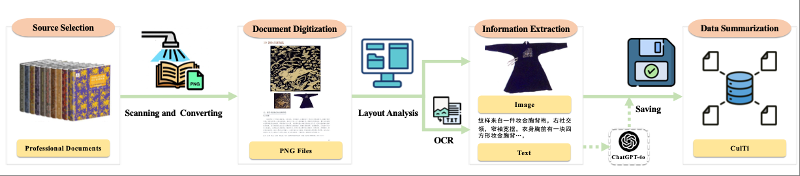
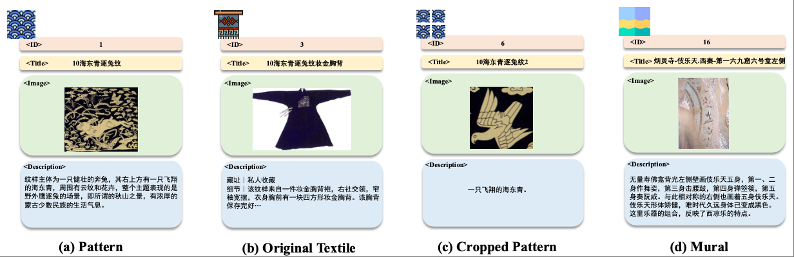
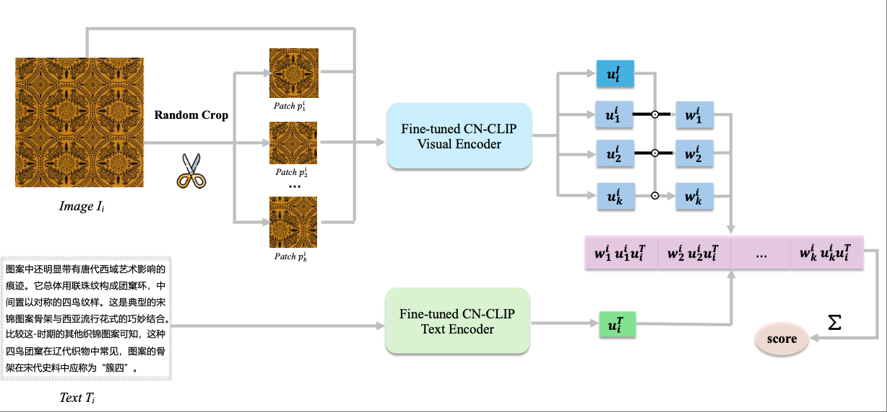
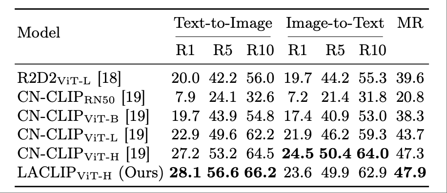

 

# CulTi: A Multimodal Dataset for Cross-modal Retrieval in Chinese Cultural Heritage

This repository hosts the dataset **CulTi**, introduced in the paper:  
**"Towards Cross-modal Retrieval in Chinese Cultural Heritage Documents: Dataset and Solution"**  
*Junyi Yuan, Jian Zhang, Fangyu Wu, Huanda Lu, Dongming Lu, Qiufeng Wang*

[](https://arxiv.org/abs/xxxx.xxxxx) <!-- TODO: Replace with actual arXiv link -->

---

## 📖 Introduction

China has a long and rich history, encompassing diverse cultural heritage such as **silk patterns** and **Dunhuang murals**.  
To bridge **visual** and **textual modalities** in these domains, we introduce **CulTi**, the **first multimodal dataset** dedicated to Chinese cultural heritage.

- **5,726 image-text pairs**  
- Sources: *Original Patterns From Ancient Chinese Textiles* (silk) & *Complete Collection of Chinese Dunhuang Murals*  
- Each entry includes: **ID, title, image, textual description**  
- Designed for **cross-modal retrieval tasks** (image-to-text, text-to-image)
<p align="center">
    
</p> 
---

## 📂 Dataset Structure
<p align="center">
    
</p> 

- **Images**: high-quality scans of silk patterns, cropped motifs, Dunhuang murals  
- **Texts**: simplified Chinese descriptions, OCR + refined with GPT-4o  
- **Split**: 7:1:2 (train/val/test)

<p align="center">
    
</p> 
---

## 🚀 Download

The dataset is hosted on Google Drive:  

[](https://drive.google.com/xxxxx) <!-- TODO: Insert real link -->

⚠️ **Note:** To ensure proper usage, dataset access is **password-protected**.  
Please follow the agreement instructions below.

---

## 📑 Access Protocol

To access the dataset, please:  
1. **Fill in the Data Usage Agreement Form** [](https://example.com/agreement) <!-- TODO: Replace with real link -->  
2. After review, you will receive the **password** via email.  
3. Use the password to unzip the dataset files.

---

## 🧪 Benchmark & Results

We propose **LACLIP**, a local alignment strategy based on Chinese-CLIP,  
which significantly improves cross-modal retrieval on CulTi.
<p align="center">
    
</p> 

<p align="center">
 
</p> 
---

## 📜 Citation

If you use **CulTi** in your research, please cite:

```bibtex
@inproceedings{yuan2025culti,
  title={Towards Cross-modal Retrieval in Chinese Cultural Heritage Documents: Dataset and Solution},
  author={Yuan, Junyi and Zhang, Jian and Wu, Fangyu and Lu, Huanda and Lu, Dongming and Wang, Qiufeng},
  booktitle={ICDAR},
  year={2023}
}
